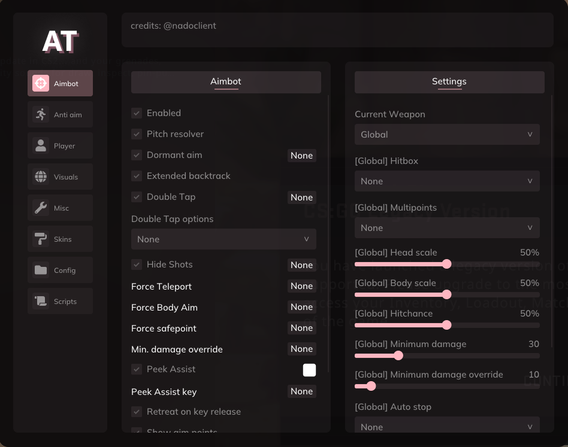

<p align="center">
  
</p>

# arctictech-csgo (improved fork)

> **forked from:** [x64penguin/arctic](https://github.com/x64penguin/arctic)
> **all credits** for the original work go to **[x64penguin](https://github.com/x64penguin)**.
> this fork focuses on improving, fixing, and updating the original arctictech csgo cheat.

---

## ❄️ overview

this is my personal fork of **arctictech**, an open-source csgo cheat base.
my goal is to fix existing bugs, modernize parts of the codebase, and make it easier for developers to build on top of it.
in addition to general fixes and optimizations, i'm focusing on improving the resolver, accuracy, animation system, and anything else i've encountered using it.

---

## 🧰 features (inherited & improved)

* improved resolver logic
* improved ragebot (sorta)
* fixed any pontenional leaks and crashes (some crashing still occur, albeit less often).

---

## 🛠️ setup & build instructions

### requirements

* windows 10 or 11 (x64)
* visual studio 2022 (latest version recommended)
* directx sdk

### building

1. clone the repository:

   ```bash
   git clone https://github.com/lanesuwu/arctictech-fork.git
   ```
2. open `arctic.sln` in visual studio.
3. set build configuration to **release | x86**.
4. build the solution.
5. inject dll into csgo using your preferred injector.

---

## 🧾 credits

* **original author:** [x64penguin](https://github.com/x64penguin)
* **forked & maintained by:** [lanes](https://github.com/lanesuwu)

---

**last updated:** october 2025
